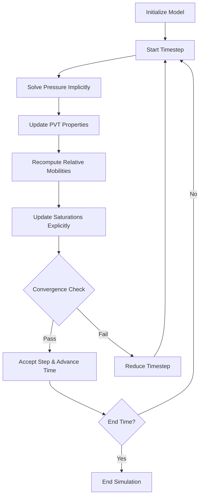

# Simulation Workflow

## From Model to Results

Running a reservoir simulation in BORES follows a clear pipeline: you build a reservoir model, configure the simulation parameters, call `bores.run()`, and iterate over the results. Under the hood, the simulator marches forward in time, solving for pressure and saturation at each timestep, checking convergence, and yielding snapshots of the model state at intervals you control.

This page walks you through what happens inside that loop - how BORES solves the pressure equation, updates fluid properties, computes phase velocities, evolves saturations, and manages timestep size. Understanding this workflow will help you interpret simulation results, diagnose convergence issues, and choose appropriate solver settings for your problem.

BORES supports three evolution schemes: **IMPES** (Implicit Pressure, Explicit Saturation), **explicit** (both pressure and saturation explicit), and **implicit** (fully implicit, currently in development). IMPES is the default and recommended scheme for most problems. The explicit scheme is available as an alternative for problems where you want simpler numerics at the cost of smaller timesteps.

## The IMPES Method

IMPES (Implicit Pressure, Explicit Saturation) is the primary solution scheme in BORES and the one you should use unless you have a specific reason not to. It splits the coupled pressure-saturation system into two sequential steps: first solve pressure implicitly (by assembling and solving a linear system), then update saturations explicitly (by computing fluxes from the new pressure field). This splitting is the key design choice that makes IMPES both efficient and practical.

The implicit pressure step means that pressure changes of any magnitude can be handled stably in a single timestep - there is no CFL-like stability limit on the pressure update. The explicit saturation step means that saturation updates are cheap (no linear system to solve), but the timestep size must be kept small enough that saturation fronts do not jump more than one cell per step. In practice, this is rarely a binding constraint for field-scale simulations where fronts move slowly relative to the grid spacing.

Here is the sequence of operations that BORES executes at each IMPES timestep:

1. **Solve pressure implicitly** - Assemble the pressure coefficient matrix and right-hand side from current fluid properties, transmissibilities, compressibilities, and well terms. Solve the resulting sparse linear system using an iterative solver (BiCGSTAB by default) with a preconditioner (ILU by default).

2. **Update PVT properties** - Recompute all pressure-dependent fluid properties (formation volume factors, viscosities, solution GOR, compressibilities, densities) at the new pressure. This is critical because the saturation update that follows needs accurate fluid properties at the new pressure.

3. **Recompute relative mobilities** - Rebuild phase mobilities ($\lambda_\alpha = k_{r\alpha} / \mu_\alpha$) using the updated viscosities from step 2 and the current relative permeabilities.

4. **Update saturations explicitly** - Compute inter-cell fluxes using Darcy's law with the new pressure gradient and current mobilities. Update oil, water, and gas saturations in each cell based on the net flux balance and well source/sink terms. Enforce the saturation constraint $S_o + S_w + S_g = 1$.

5. **Check convergence and adjust timestep** - Verify that saturation changes and pressure changes are within configured limits. If they are, accept the step and advance time. If not, reject the step, reduce the timestep, and retry.

The following diagram illustrates this loop:



!!! info "Why PVT Updates Happen Between Pressure and Saturation"
    In the IMPES scheme, PVT properties are updated *after* the implicit pressure solve but *before* the explicit saturation update. This is intentional: pressure changes affect viscosity, density, and compressibility, which in turn affect phase mobility and transport. By updating PVT between the two steps, the saturation transport uses fluid properties that are consistent with the new pressure field. In contrast, the explicit scheme updates PVT *after* both pressure and saturation have been evolved, using old-time values for transport coefficients. This difference is one reason IMPES is generally more accurate at larger timesteps.

## The Explicit Scheme

The explicit scheme solves both pressure and saturation using explicit (forward-in-time) finite difference updates. No linear system is assembled or solved - each cell's new pressure and saturation are computed directly from the old-time values and the fluxes through its faces.

The main advantage of the explicit scheme is simplicity and per-step speed. There is no matrix assembly, no iterative solver, and no preconditioner. Each timestep is just a sequence of array operations. The main disadvantage is stability: the CFL condition constrains the timestep to be small enough that information does not travel more than one cell width per step. For fine grids or high-permeability zones, this can force very small timesteps, making the overall simulation slower than IMPES despite the cheaper per-step cost.

You select the explicit scheme by setting `scheme="explicit"` in your `Config`:

```python
import bores

config = bores.Config(
    timer=bores.Timer(
        initial_step_size=bores.Time(hours=1),
        max_step_size=bores.Time(days=1),
        min_step_size=bores.Time(seconds=10),
        simulation_time=bores.Time(days=365),
    ),
    rock_fluid_tables=rock_fluid,
    wells=wells,
    scheme="explicit",  # Use explicit scheme instead of IMPES
)
```

!!! warning "Stability with the Explicit Scheme"
    The explicit scheme requires smaller timesteps than IMPES to remain stable. BORES monitors the CFL number at each step and will reject steps that exceed the configured `pressure_cfl_threshold` (default 0.9) or `saturation_cfl_threshold` (default 0.6). If your simulation is rejecting many steps, try reducing `max_step_size` in the `Timer` or switching to `scheme="impes"`.

## Timestep Control

Choosing the right timestep size is critical for balancing accuracy, stability, and computational speed. Too large a timestep causes convergence failures and inaccurate results. Too small a timestep wastes computation on unnecessarily fine time resolution. BORES uses an adaptive timestep controller (the `Timer` class) that automatically adjusts the step size based on what is happening in the simulation.

The `Timer` manages timestep size through several mechanisms working together:

**Ramp-up at simulation start.** The initial timestep is typically small (specified by `initial_step_size`) and grows gradually over the first several steps. This protects against the pressure transient that often occurs at the very start of a simulation when wells first begin operating.

**Growth on success.** After each successful timestep, the `Timer` may increase the next step size, subject to `max_growth_per_step` (default 1.3, meaning at most 30% growth per step) and `max_step_size`. Growth is also controlled by a cooldown period (`growth_cooldown_steps`) that prevents aggressive growth immediately after a failure.

**Backoff on failure.** When a timestep is rejected (because pressure or saturation changes exceeded their limits, or the solver failed to converge), the `Timer` reduces the step size by `backoff_factor` (default 0.5) and retries. If multiple consecutive failures occur, it uses `aggressive_backoff_factor` (default 0.25) for a more dramatic reduction.

**CFL-based adjustment.** For the explicit scheme, the `Timer` monitors the CFL number and adjusts the step size to keep it below the safety margin. This is the primary stability control for explicit simulations.

**Change-based limits.** The `Config` specifies maximum allowable changes per timestep for pressure (`max_pressure_change`, default 100 psi) and for each phase saturation (`max_oil_saturation_change`, `max_water_saturation_change`, `max_gas_saturation_change`). If any of these limits are exceeded, the step is rejected and retried with a smaller timestep.

```python
import bores

Time = bores.Time

timer = bores.Timer(
    initial_step_size=Time(days=0.5),     # Start with half-day steps
    max_step_size=Time(days=30),          # Allow up to 30-day steps
    min_step_size=Time(minutes=30),       # Never go below 30 minutes
    simulation_time=Time(years=10),       # Run for 10 years
    max_growth_per_step=1.3,              # Grow at most 30% per step
    backoff_factor=0.5,                   # Halve step size on failure
)
```

!!! tip "Timer Settings for Different Problems"
    - **Waterflooding (slow fronts):** `initial_step_size=Time(days=1)`, `max_step_size=Time(days=30)`
    - **Gas injection (fast fronts):** `initial_step_size=Time(hours=6)`, `max_step_size=Time(days=5)`
    - **Early-time transient (well startup):** `initial_step_size=Time(minutes=30)`, allow ramp-up
    - **Depletion (slow, uniform):** `initial_step_size=Time(days=5)`, `max_step_size=Time(days=60)`

## What Happens Each Timestep

Let us walk through a single IMPES timestep in more detail to give you a concrete picture of what the simulator is doing.

**1. Propose a timestep size.** The `Timer` proposes a step size $\Delta t$ based on the history of previous steps - whether they succeeded or failed, how large the CFL number was, and how much the pressure and saturation changed. This proposed size is a "trial" - it may be rejected later.

**2. Apply boundary conditions.** Before solving anything, BORES updates the ghost cells (the padding layer around the grid) to reflect the current boundary conditions. For constant-pressure boundaries, the ghost cells are set to the boundary pressure. For no-flow boundaries (the default), ghost cells mirror their interior neighbors. For time-dependent boundaries like Carter-Tracy aquifers, the influx is computed based on the current pressure history.

**3. Build rock-fluid property grids.** Relative permeabilities are computed from the current saturations using the rock-fluid tables you configured (Corey, Brooks-Corey, LET, etc.). Relative mobilities are then computed as $\lambda_\alpha = k_{r\alpha} / \mu_\alpha$. Capillary pressures are computed if enabled.

**4. Solve the pressure equation.** The pressure coefficient matrix $\mathbf{A}$ and right-hand side vector $\mathbf{b}$ are assembled from transmissibilities, compressibilities, well terms, and gravity terms. The system $\mathbf{A} \mathbf{p}^{n+1} = \mathbf{b}$ is solved using the configured iterative solver and preconditioner. The solution gives the new pressure field.

**5. Validate the pressure solution.** BORES checks that no cell has an unphysical pressure (negative or extremely high). If unphysical pressures are detected, the step is rejected with a diagnostic message.

**6. Update PVT properties.** All pressure-dependent fluid properties are recomputed at the new pressure: formation volume factors ($B_o$, $B_g$, $B_w$), viscosities ($\mu_o$, $\mu_g$, $\mu_w$), solution GOR ($R_s$), gas solubility in water ($R_{sw}$), compressibilities, and densities. If you provided PVT tables, they are used for interpolation; otherwise, correlations are evaluated.

**7. Update saturations.** Inter-cell Darcy fluxes are computed from the new pressure gradient and current mobilities. Each cell's saturation is updated based on the net flux balance:

$$S_\alpha^{n+1} = S_\alpha^n + \frac{\Delta t}{\phi V_b} \left( \sum_{\text{faces}} q_\alpha + Q_\alpha^{\text{well}} \right)$$

where $V_b$ is the bulk cell volume, $q_\alpha$ is the flux of phase $\alpha$ through a cell face, and $Q_\alpha^{\text{well}}$ is the well source/sink term.

**8. Check changes.** The maximum pressure change and maximum saturation change across all cells are compared against the configured limits. If either exceeds its limit, the step is rejected, the timestep is reduced, and the simulator returns to step 1 with the smaller timestep. The old pressure and saturation fields are restored.

**9. Record state.** If the step is accepted and it falls on an output interval (controlled by `output_frequency` in `Config`), a `ModelState` snapshot is captured and yielded to the caller. This snapshot contains the full reservoir model state, well data, relative permeabilities, rate grids, and timer state.

## Running a Simulation in BORES

With all the theory covered, here is what the actual code looks like. The `bores.run()` function is a Python generator that yields `ModelState` objects at each output interval.

```python
import bores

# Assume model and config have been set up
# (see the Quick Example on the home page for full setup)

# bores.run() returns a generator - it computes one step at a time
simulation = bores.run(model, config)

# Iterate over the results
for state in simulation:
    pressure = state.model.fluid_properties.pressure_grid
    oil_sat = state.model.fluid_properties.oil_saturation_grid
    print(
        f"Step {state.step:4d} | "
        f"Time: {state.time_in_days:8.1f} days | "
        f"Avg P: {pressure.mean():8.1f} psi | "
        f"Avg So: {oil_sat.mean():.4f}"
    )
```

The generator pattern is important: BORES does not compute all timesteps upfront and store them in memory. It computes one step at a time and yields the result. This means you can process results as they arrive, stop early if a condition is met, or stream results to disk without holding the entire simulation history in memory.

You can also use the `Run` class for a more structured approach, especially when loading models and configs from files:

```python
import bores

# Create a Run from files
sim_run = bores.Run.from_files(
    model_path="model.h5",
    config_path="config.yaml",
    pvt_table_path="pvt.h5",  # Optional
)

# Iterate directly over the Run object
for state in sim_run:
    process(state)
```

!!! example "Collecting All States"
    If your model is small enough to fit in memory, you can collect all states into a list for post-processing:

    ```python
    states = list(bores.run(model, config))
    final_state = states[-1]
    print(f"Simulation completed: {final_state.step} steps, {final_state.time_in_days:.1f} days")
    ```

    For large models, consider using BORES streaming utilities (`bores.streams`) to pipe results to disk (HDF5, Zarr, or pickle) instead of holding them all in memory.

## The `ModelState` Object

Each yielded `ModelState` contains a complete snapshot of the simulation at that point in time. Here are the key attributes you will use most often:

| Attribute | Type | Description |
|---|---|---|
| `state.step` | `int` | Timestep index |
| `state.step_size` | `float` | Timestep size in seconds |
| `state.time` | `float` | Elapsed simulation time in seconds |
| `state.time_in_days` | `float` | Elapsed simulation time in days |
| `state.model` | `ReservoirModel` | Full reservoir model with updated properties |
| `state.model.fluid_properties.pressure_grid` | `ndarray` | Pressure at each cell (psi) |
| `state.model.fluid_properties.oil_saturation_grid` | `ndarray` | Oil saturation at each cell |
| `state.model.fluid_properties.water_saturation_grid` | `ndarray` | Water saturation at each cell |
| `state.model.fluid_properties.gas_saturation_grid` | `ndarray` | Gas saturation at each cell |
| `state.injection` | `RateGrids` | Injection rates (oil, water, gas) in ft3/day |
| `state.production` | `RateGrids` | Production rates (oil, water, gas) in ft3/day |
| `state.wells` | `Wells` | Well configuration at this state |

Because every property is a NumPy array, you can perform any NumPy operation on the results - compute field averages, extract well-block values, calculate material balance, or feed the data into your own analysis pipeline.

## Solver and Preconditioner Selection

The pressure equation at each IMPES timestep requires solving a sparse linear system. The choice of solver and preconditioner affects both the speed and robustness of the simulation. BORES provides several options that you configure through the `Config` class.

=== "Default (BiCGSTAB + ILU)"

    ```python
    config = bores.Config(
        timer=timer,
        rock_fluid_tables=rock_fluid,
        pressure_solver="bicgstab",
        pressure_preconditioner="ilu",
        # ... other parameters
    )
    ```

    The default combination of BiCGSTAB solver with ILU preconditioner works well for most problems and is the recommended starting point.

=== "Difficult Problems (GMRES + CPR)"

    ```python
    config = bores.Config(
        timer=timer,
        rock_fluid_tables=rock_fluid,
        pressure_solver="gmres",
        pressure_preconditioner="cpr",
        # ... other parameters
    )
    ```

    For problems with strong coupling, high permeability contrasts, or convergence difficulties, try GMRES with the CPR (Constrained Pressure Residual) preconditioner.

=== "Fast/Well-Conditioned (CG + Diagonal)"

    ```python
    config = bores.Config(
        timer=timer,
        rock_fluid_tables=rock_fluid,
        pressure_solver="cg",
        pressure_preconditioner="diagonal",
        # ... other parameters
    )
    ```

    For well-conditioned problems (homogeneous reservoirs, mild contrasts), the conjugate gradient solver with a diagonal preconditioner is the cheapest option.

!!! danger "Direct Solver Warning"
    Avoid using `pressure_solver="direct"` for grids larger than about 50,000 cells. The direct solver (sparse LU factorization) has $O(n^{1.5})$ to $O(n^2)$ memory scaling, and BORES will warn you about estimated memory usage for large systems. Iterative solvers with good preconditioners are almost always faster and more memory-efficient for reservoir simulation problems.

For a comprehensive guide to solver and preconditioner selection, including performance benchmarks and tuning advice, see the [Solvers and Preconditioners](../user-guide/simulation/solvers.md) guide.
