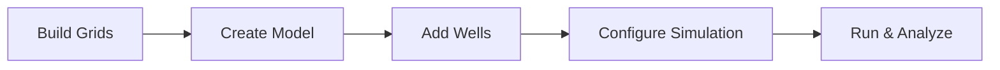
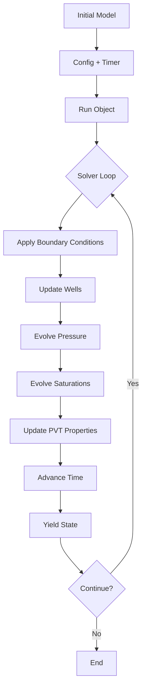

# Core Concepts

Understanding these core concepts will help you master BORES quickly.

---

## The BORES Workflow

Every BORES simulation follows this pattern:



Let's explore each component.

---

## 1. Grids: The Foundation

In BORES, **everything is a 3D grid** (NumPy array with shape `(nx, ny, nz)`).

### Grid Types

```python
# Uniform: Same value everywhere
pressure = bores.uniform_grid(grid_shape=(20, 20, 10), value=3000.0)
# Result: 20×20×10 array, all cells = 3000.0 psi

# Layered: Different value per layer
porosity = bores.layered_grid(
    grid_shape=(20, 20, 10),
    layer_values=[0.15, 0.18, 0.20, ...],  # 10 values for 10 layers
    orientation=bores.Orientation.Z,  # Stack along z-axis
)
# Result: Layer 0 has 0.15, layer 1 has 0.18, etc.
```

!!! tip "Grid Philosophy"
    BORES uses **grids for everything** - pressure, saturation, permeability, temperature, etc. This makes the framework:
    
    - **Flexible**: Easy to create heterogeneous models
    - **Fast**: NumPy vectorization
    - **Simple**: One data structure to learn

### Grid Manipulation

Grids are just NumPy arrays - modify them freely:

```python
# Create uniform grid
perm = bores.uniform_grid(grid_shape, 100.0)  # mD

# Add high-perm channel
perm[10:15, :, 5] = 500.0  # Channel in layer 5

# Add low-perm fault zone
perm[8, :, :] = 10.0  # Vertical barrier at x=8
```

---

## 2. The Reservoir Model

The `ReservoirModel` is the central data structure containing all reservoir properties.

### Model Anatomy

```python
model = bores.reservoir_model(
    grid_shape=(nx, ny, nz),
    cell_dimension=(dx, dy),  # Horizontal spacing (ft)
    thickness_grid=thickness,  # Vertical spacing (ft)

    # Rock properties
    porosity_grid=porosity,
    absolute_permeability=permeability,  # RockPermeability object
    rock_compressibility=4.5e-6,  # 1/psi

    # Fluid properties
    pressure_grid=pressure,
    oil_saturation_grid=oil_sat,
    water_saturation_grid=water_sat,
    gas_saturation_grid=gas_sat,
    temperature_grid=temperature,

    # PVT properties
    oil_viscosity_grid=oil_visc,
    oil_compressibility_grid=oil_comp,
    oil_bubble_point_pressure_grid=bubble_point,

    # ... more properties
)
```

!!! info "Immutability"
    Models are **immutable** (cannot be modified after creation). To change properties, create a new model or use `attrs.evolve()`. Yes! Most of the datastructures BORES uses are `attrs` classes.

### Accessing Model Properties

```python
# During simulation
state = next(run())  # Get resulting model state after first timestep

# Access fluid properties
pressure = state.model.fluid_properties.pressure_grid
oil_sat = state.model.fluid_properties.oil_saturation_grid

# Access rock properties
porosity = state.model.rock_properties.porosity_grid
perm = state.model.rock_properties.absolute_permeability
```

---

## 3. Wells: The Interface

Wells are how you interact with the reservoir - injecting or producing fluids.

### Well Anatomy

```python
producer = bores.production_well(
    well_name="P-1",

    # Where is the well?
    perforating_intervals=[
        ((5, 10, 2), (5, 10, 4))  # From cell (5,10,2) to (5,10,4)
    ],

    # How does it operate?
    control=bores.MultiPhaseRateControl(
        oil_control=bores.AdaptiveBHPRateControl(
            target_rate=-150, # STB/day (negative = production)
            target_phase="oil",
            bhp_limit=1200, # psi (minimum bottomhole pressure)
            clamp=production_clamp,
        ),
        gas_control=bores.AdaptiveBHPRateControl(
            target_rate=-500, # SCF/day (negative = production)
            target_phase="gas",
            bhp_limit=1200,
            clamp=production_clamp,
        ),
        water_control=bores.AdaptiveBHPRateControl(
            target_rate=-10, # STB/day (negative = production)
            target_phase="water",
            bhp_limit=1200,
            clamp=production_clamp,
        ),
    ),

    # What fluid phases does it produce? What are the PVT properties of those phases?
    produced_fluids=(
        bores.ProducedFluid(
            name="Oil",
            phase=bores.FluidPhase.OIL,
            specific_gravity=0.845,
            molecular_weight=180.0,
        ),
        bores.ProducedFluid(
            name="Gas",
            phase=bores.FluidPhase.GAS,
            specific_gravity=0.65,
            molecular_weight=16.04,
        ),
        bores.ProducedFluid(
            name="Water",
            phase=bores.FluidPhase.WATER,
            specific_gravity=1.05,
            molecular_weight=18.015,
        ),
    ),

    # Physical properties
    radius=0.354,  # ft (wellbore radius)
    skin_factor=2.5,  # Damage/stimulation
    is_active=True,
)
```

### Well Controls

BORES supports multiple control modes:

| Control Type | Use Case | Example |
|--------------|----------|---------|
| `ConstantRateControl` | Fixed injection rate | Water injection at 500 STB/day, stop production if BHP < 800 psi |
| `AdaptiveBHPRateControl` | Production with BHP limit | Produce oil at 500 STB/day, adjust rate if BHP < 800 psi |
| `BHPControl` | Fixed bottomhole pressure | Maintain BHP at 3000 psi, resulting rate depends of pressure gradient |
| `MultiPhaseRateControl` | Independent phase controls | Different limits for oil/water/gas |

!!! tip "Adaptive vs Constant"
    - **Constant**: Rate never changes (can violate BHP limits)
    - **Adaptive**: Rate adjusts to respect BHP limits (more realistic)

---

## 4. Configuration: Bringing It Together

The `Config` object controls **how** the simulation runs.

### Config Components

```python
config = bores.Config(
    # Timing
    timer=timer,  # Controls timesteps

    # Wells
    wells=wells,  # Injectors and producers
    well_schedules=schedules,  # Time-dependent controls (optional)

    # Physics
    rock_fluid_tables=rock_fluid_tables,  # Rel perm & cap pressure
    boundary_conditions=boundary_conditions,  # Aquifer, etc. (optional)
    pvt_tables=pvt_tables,  # PVT lookup tables (optional)

    # Numerical scheme
    scheme="impes",  # or "explicit"
    pressure_solver="bicgstab",
    pressure_preconditioner="ilu",

    # Tolerances
    pressure_convergence_tolerance=1e-6,
    saturation_convergence_tolerance=1e-4,
    max_iterations=200,

    # Output
    output_frequency=1,  # Yield state every N steps
    log_interval=5,  # Log/Print progress every N steps
)
```

### The Timer: Adaptive Timestepping

The `Timer` controls simulation duration and timestep adaptation:

```python
timer = bores.Timer(
    # Timestep bounds
    initial_step_size=bores.Time(hours=4),
    max_step_size=bores.Time(days=5),
    min_step_size=bores.Time(minutes=10),

    # Simulation duration
    simulation_time=bores.Time(days=365 * 5),  # 5 years

    # CFL stability
    max_cfl_number=0.9,

    # Adaptation
    ramp_up_factor=1.2,  # Grow by 20% on success
    backoff_factor=0.5,  # Shrink by 50% on failure
)
```

!!! info "CFL Number"
    The Courant-Friedrichs-Lewy (CFL) condition ensures numerical stability:

    \\[
    \text{CFL} = \frac{v \cdot \Delta t}{\Delta x} < 1
    \\]

    BORES automatically adjusts timesteps to maintain stability.

---

## 5. Running Simulations

The `Run` object executes the simulation and yields results.

### Basic Usage

```python
run = bores.Run(model=model, config=config)

# Iterate through timesteps
for state in run():
    # Access results
    time_days = state.time / 86400
    avg_pressure = state.model.fluid_properties.pressure_grid.mean()

    print(f"Day {time_days:.1f}: Pressure = {avg_pressure:.1f} psi")
```

### State Object

Each iteration yields a `ModelState`:

```python
state.step           # Timestep index (0, 1, 2, ...)
state.time           # Simulation time (seconds)
state.step_size      # Timestep size (seconds)
state.model          # Updated ReservoirModel
state.wells          # Wells configuration
state.injection      # Injection rate grids
state.production     # Production rate grids
state.relative_permeabilities  # kr grids
state.capillary_pressures      # Pc grids
```

---

## 6. Data Flow

Understanding how data flows through BORES:



### Solver Schemes

BORES supports two schemes:

#### IMPES (Default)

**Implicit Pressure, Explicit Saturation**

1. Solve pressure implicitly (linear system)
2. Update saturations explicitly (explicit formula)
3. Update well rates
4. Advance timestep

**Pros**: Fast, stable for most problems

**Cons**: Requires CFL constraint

#### Explicit

**Fully Explicit**

1. Update pressure explicitly
2. Update saturations explicitly
3. Update well rates
4. Advance timestep

**Pros**: Fastest per timestep

**Cons**: Requires very small timesteps

!!! tip "Which Scheme?"
    Use **IMPES** (default) for most simulations. Only use explicit for testing or when you need extreme control.

---

## 7. Units Convention

BORES uses **Oilfield Units** throughout:

| Property | Unit |
|----------|------|
| Length | feet (ft) |
| Pressure | psi |
| Temperature | °F |
| Oil rate | STB/day |
| Gas rate | SCF/day |
| Water rate | STB/day |
| Permeability | millidarcy (mD) |
| Viscosity | centipoise (cP) |
| Density | lbm/ft³ |
| Time | seconds (internal), days (display) |

!!! warning "Time Conversion"
    Internally, BORES uses **seconds**. Use `bores.Time()` for convenience:

    ```python
    bores.Time(days=365)      # → 31,536,000 seconds
    bores.Time(hours=4.5)     # → 16,200 seconds

    # Convert back
    time_seconds = state.time
    time_days = time_seconds / 86400  # seconds per day
    ```

---

## 8. Precision Control

BORES supports 32-bit and 64-bit precision:

```python
# 32-bit (default) - half memory, faster
bores.use_32bit_precision()

# 64-bit - more accuracy
bores.use_64bit_precision()

# Check current
dtype = bores.get_dtype()  # numpy.float32 or numpy.float64

# Create arrays with current precision
arr = bores.array([1, 2, 3])  # Uses configured dtype
```

!!! tip "When to Use Each"
    - **32-bit**: Default for most simulations (4K-100K cells)
    - **64-bit**: Very large models, long simulations, or high precision requirements

---

## 9. Black-Oil Model

BORES implements the **Standard Black-Oil Formulation** - a simplified model for reservoir simulation.

### Assumptions

1. **Three phases**: Oil, water, gas
2. **Two hydrocarbon components**: Oil component, gas component, plus a separate water component.
3. **Gas dissolves in oil** (solution gas), but oil doesn't dissolve in gas.
4. **No water volatility**: Water is incompressible (small compressibility)
5. **Isothermal**: Temperature doesn't change significantly

### Key Parameters

```python
# Solution GOR: How much gas dissolves in oil
Rs = 500  # SCF/STB at current pressure

# Formation volume factor: Volume change due to gas
Bo = 1.25  # RB/STB (reservoir barrels per stock tank barrel)

# Bubble point: Pressure below which gas evolves
Pb = 2000  # psi
```

!!! info "Undersaturated vs Saturated"
    - **Undersaturated** (P > Pb): No free gas, all gas dissolved
    - **Saturated** (P = Pb): Gas starts to evolve
    - **Supersaturated** (P < Pb): Free gas phase exists

---

## 10. Common Patterns

### Pattern 1: Heterogeneous Models

```python
# Start with base property
perm = bores.uniform_grid(grid_shape, 50.0)

# Add high-perm layer
perm[:, :, 5] = 200.0

# Add channel
perm[10:15, :, 5] = 500.0

# Use it
model = bores.reservoir_model(..., absolute_permeability=bores.RockPermeability(x=perm, y=perm, z=perm*0.1))
```

### Pattern 2: Time Conversion

```python
# Always convert time to days for readability
for state in run():
    time_days = state.time / 86400
    print(f"Day {time_days:.1f}")
```

### Pattern 3: Well Scheduling

```python
# Change well controls over time
schedule = bores.WellSchedule(
    well_name="P-1",
    entries=[
        bores.ScheduleEntry(
            start_time=bores.Time(days=0),
            control=initial_control,
        ),
        bores.ScheduleEntry(
            start_time=bores.Time(days=365),
            control=increased_control,
        ),
    ],
)
```

---

## Summary

You now understand:

**Key Concepts:**

- **Grids**: Everything is a 3D NumPy array
- **Models**: Immutable containers of reservoir properties
- **Wells**: How to inject/produce fluids
- **Config**: Controls simulation behavior
- **Run**: Executes simulation and yields states
- **Units**: Oilfield units throughout
- **Black-oil**: Three-phase, two-component formulation

---

## Next Steps

Now that you understand the fundamentals, let's build real simulations:

[:octicons-arrow-right-24: Start Tutorials](../tutorials/index.md)

Or dive deeper into specific topics:

- [Building Models](../guides/building-models.md)
- [Wells & Controls](../guides/wells-and-controls.md)
- [Running Simulations](../guides/running-simulations.md)
