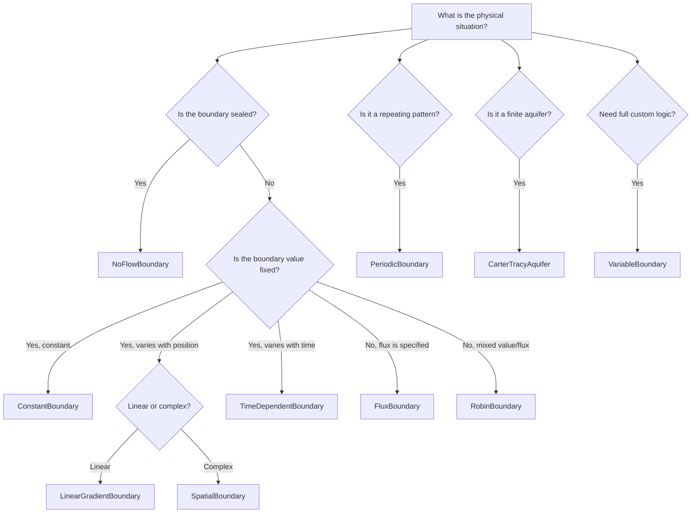

# Boundary Conditions

## Overview

Boundary conditions define how the edges of your simulation grid interact with the outside world. By default, all grid boundaries are no-flow (closed), meaning no fluid enters or leaves through any face of the grid. This is appropriate for many reservoir simulations where the reservoir is bounded by impermeable rock, but many real reservoirs have open boundaries that communicate with aquifers, adjacent formations, or surface conditions.

BORES provides ten boundary condition types covering the full range of physical situations encountered in reservoir simulation. You can set different conditions on each face of the grid (left, right, front, back, top, bottom), and you can combine multiple boundary types to model complex reservoir geometries.

The boundary condition system follows the standard classification from partial differential equations:

| PDE Classification | BORES Type | Physical Meaning |
|---|---|---|
| Dirichlet (fixed value) | `ConstantBoundary`, `LinearGradientBoundary`, `SpatialBoundary`, `TimeDependentBoundary` | Fixed pressure, temperature, or saturation at boundary |
| Neumann (fixed flux) | `FluxBoundary` | Fixed injection/production rate at boundary |
| Robin (mixed) | `RobinBoundary` | Pressure-dependent flow through semi-permeable barrier |
| Periodic | `PeriodicBoundary` | Opposite faces connected (repeating domain) |
| Semi-analytical | `CarterTracyAquifer` | Finite aquifer with time-dependent pressure support |

!!! info "Sign Convention (Library-Wide Standard)"

    Throughout BORES, positive flow means **injection** (into the reservoir) and negative flow means **production** (out of the reservoir). This convention is consistent across wells, boundary conditions, and all flow terms.

---

## Quick Reference

| Boundary Type | Parameters | Requires Metadata | Use Case |
|---|---|---|---|
| `NoFlowBoundary` | None | No | Sealed/impermeable boundaries (default) |
| `ConstantBoundary` | `constant` | No | Fixed pressure inlet/outlet, infinite aquifer |
| `FluxBoundary` | `flux` | `cell_dimension` | Fixed injection/production rate |
| `LinearGradientBoundary` | `start`, `end`, `direction` | `coordinates` | Tilted aquifer contacts, regional gradients |
| `SpatialBoundary` | `func` | `coordinates` | Depth-dependent pressure, radial patterns |
| `TimeDependentBoundary` | `func` | `time` | Cyclic injection, pressure ramps |
| `VariableBoundary` | `func` | Optional | Fully custom logic (state-dependent) |
| `RobinBoundary` | `alpha`, `beta`, `gamma` | `cell_dimension` | Semi-permeable barriers, convective transfer |
| `PeriodicBoundary` | None | No | Repeating well patterns, infinite domains |
| `CarterTracyAquifer` | Physical props or constant | `time` | Realistic finite aquifer support |

---

## Grid Faces and Ghost Cells

BORES uses a ghost cell approach for boundary conditions. Each grid dimension is padded with one layer of ghost cells on each side. The six grid faces are:

| Face | Direction | Index | Physical Meaning |
|---|---|---|---|
| `left` | x- | `i = 0` | West face |
| `right` | x+ | `i = -1` | East face |
| `front` | y- | `j = 0` | South face |
| `back` | y+ | `j = -1` | North face |
| `bottom` | z- | `k = 0` | Top/shallowest layer |
| `top` | z+ | `k = -1` | Bottom/deepest layer |

!!! note "Z-Axis Convention"

    In BORES, `k=0` is the **top** (shallowest) layer and `k` increases **downward**. So `bottom` (`z-`) corresponds to the shallowest depth and `top` (`z+`) corresponds to the deepest.

For a 3D grid with shape `(nx, ny, nz)`, the padded grid has shape `(nx+2, ny+2, nz+2)`. The boundary condition's `apply()` method sets the ghost cell values so that the finite-difference stencil produces the correct physical behavior at the boundary.

---

## Boundary Condition Types

### No-Flow Boundary (Default)

- **Class:** `NoFlowBoundary`
- **PDE type:** Homogeneous Neumann ($\partial \phi / \partial n = 0$)
- **Parameters:** None
- **Metadata required:** None

No-flow boundaries prevent any fluid from crossing the boundary face. The ghost cell is set equal to the neighboring interior cell, making the gradient across the boundary zero. This is the default for all grid faces.

```python
from bores.boundary_conditions import NoFlowBoundary

no_flow = NoFlowBoundary()
```

**When to use:**

- Impermeable rock surrounding the reservoir (faults, shale barriers)
- Sealed reservoir boundaries with no external communication
- Symmetry planes where you simulate half or quarter of the domain

You rarely need to create `NoFlowBoundary` objects explicitly since they are applied automatically to any face without another condition assigned.

---

### Constant Boundary (Dirichlet)

- **Class:** `ConstantBoundary`
- **Alias:** `DirichletBoundary`
- **PDE type:** Dirichlet ($\phi = C$)
- **Parameters:** `constant` (float) - the fixed boundary value
- **Metadata required:** None

Sets the boundary ghost cells to a fixed constant value. The grid's dtype is preserved.

```python
from bores.boundary_conditions import ConstantBoundary

# Fixed pressure at 2500 psi on the left face
pressure_inlet = ConstantBoundary(constant=2500.0)

# Fixed pressure at 1000 psi on the right face (production outlet)
pressure_outlet = ConstantBoundary(constant=1000.0)
```

**When to use:**

- Modeling an infinite aquifer that maintains constant pressure
- Fixed-pressure boundaries for waterflooding studies
- Upper/lower bounds on pressure in screening runs
- Laboratory core-flood experiments with constant inlet/outlet pressures

**Physical behavior:** Fluid flows freely across the boundary to maintain the specified value. If reservoir pressure drops below the boundary pressure, fluid flows in. If it rises above, fluid flows out. This provides unlimited pressure support and is the simplest aquifer approximation.

!!! warning "Infinite Support"

    Constant pressure boundaries provide **unlimited** pressure support. For finite aquifers that lose support over time, use [`CarterTracyAquifer`](#carter-tracy-aquifer) instead.

---

### Flux Boundary (Neumann)

- **Class:** `FluxBoundary`
- **Alias:** `NeumannBoundary`
- **PDE type:** Neumann ($\partial \phi / \partial n = q$)
- **Parameters:** `flux` (float) - flux value (positive = injection, negative = production)
- **Metadata required:** `cell_dimension` (dx, dy) and optionally `thickness_grid` for z-direction

Sets a specified flux (rate of change) across the boundary face. The ghost cell value is computed so that the finite-difference gradient equals the specified flux:

$$\phi_\text{ghost} = \phi_\text{neighbor} \pm \text{flux} \times \text{spacing}$$

where spacing is half the cell width in the direction normal to the boundary.

```python
from bores.boundary_conditions import FluxBoundary, BoundaryMetadata

# Water injection at 100 units/day through the left face
water_injector = FluxBoundary(flux=100.0)

# Production at 50 units/day through the right face
oil_producer = FluxBoundary(flux=-50.0)

# Zero flux (equivalent to no-flow)
sealed = FluxBoundary(flux=0.0)
```

Flux boundaries require cell dimension metadata to compute the spacing:

```python
metadata = BoundaryMetadata(
    cell_dimension=(20.0, 20.0),          # 20x20 ft cells
    thickness_grid=thickness_array,        # Optional, for z-direction
    grid_shape=(50, 25),
)
```

**When to use:**

- Known injection or production rates at boundaries
- Heat flux through reservoir cap/base rock
- Mass transfer at interfaces with known flux
- Regional flow (background velocity) through the domain

**Physical interpretation:**

- `flux > 0`: Flow **into** the reservoir (injection). Raises ghost cell pressure above neighbor.
- `flux < 0`: Flow **out of** the reservoir (production). Lowers ghost cell pressure below neighbor.
- `flux = 0`: No flow (equivalent to `NoFlowBoundary`).

---

### Linear Gradient Boundary

- **Class:** `LinearGradientBoundary`
- **PDE type:** Spatially-varying Dirichlet
- **Parameters:**

- `start` (float) - value at the beginning of the gradient
- `end` (float) - value at the end of the gradient
- `direction` (str) - `"x"`, `"y"`, or `"z"` - axis along which the gradient varies

**Metadata required:** `coordinates`

Creates a linear variation of the property across the boundary face. The value at each ghost cell is interpolated between `start` and `end` based on its coordinate along the specified direction.

```python
from bores.boundary_conditions import LinearGradientBoundary

# Pressure drops from 2500 psi at x=0 to 1500 psi at x=max
pressure_gradient = LinearGradientBoundary(
    start=2500.0,
    end=1500.0,
    direction="x",
)

# Hydrostatic pressure increases with depth
hydrostatic = LinearGradientBoundary(
    start=2000.0,    # Shallow
    end=2300.0,      # Deep
    direction="z",
)
```

Requires coordinate metadata. You can provide explicit coordinates or let BORES auto-generate them:

```python
from bores.boundary_conditions import BoundaryMetadata

# Auto-generate coordinates from cell dimensions and grid shape
metadata = BoundaryMetadata(
    cell_dimension=(20.0, 20.0),
    grid_shape=(50, 25, 10),
    thickness_grid=thickness_array,    # Needed for z-coordinates
)
```

**When to use:**

- Tilted oil-water or gas-oil contacts at the boundary
- Regional pressure gradients across the reservoir
- Hydrostatic pressure variation with depth on lateral boundaries
- Temperature gradients from geothermal heating

---

### Spatial Boundary

- **Class:** `SpatialBoundary`
- **PDE type:** Spatially-varying Dirichlet
- **Parameters:** `func` - a callable taking coordinate arrays `(x, y)` or `(x, y, z)` and returning boundary values
- **Metadata required:** `coordinates`

Applies a spatially-varying boundary condition using a coordinate-based function. This is the most flexible Dirichlet-type boundary - any function of position can define the boundary values.

```python
from bores.boundary_conditions import SpatialBoundary, boundary_function
import numpy as np

# Register function for serialization
@boundary_function
def depth_dependent_pressure(x, y):
    """Hydrostatic pressure increasing with y (depth)."""
    return 2000.0 + 0.433 * y

pressure_bc = SpatialBoundary(func=depth_dependent_pressure)

# Radial pressure distribution centered at (500, 250)
@boundary_function
def radial_pressure(x, y):
    r = np.sqrt((x - 500)**2 + (y - 250)**2)
    return 2000.0 + 0.5 * r

radial_bc = SpatialBoundary(func=radial_pressure)
```

The function receives numpy arrays for each coordinate dimension and should return an array of the same shape. For 2D grids, the function receives `(x, y)`. For 3D grids, it receives `(x, y, z)`.

**When to use:**

- Non-linear pressure distributions at boundaries (radial, polynomial)
- Complex geological boundaries (tilted contacts, curved surfaces)
- Spatially-varying temperature or concentration at boundaries
- Any situation where `LinearGradientBoundary` is too simple

!!! tip "Serialization"

    For your spatial function to be saved and loaded with the simulation configuration, register it with the `@boundary_function` decorator. Unregistered functions work during a single session but cannot be serialized.

---

### Time-Dependent Boundary

- **Class:** `TimeDependentBoundary`
- **PDE type:** Time-varying Dirichlet
- **Parameters:** `func` - a callable taking time (float, in seconds) and returning a boundary value
- **Metadata required:** `time`

Applies a boundary condition that changes over simulation time. The function receives the current simulation time in seconds and returns a scalar value applied uniformly across all ghost cells on that face.

```python
from bores.boundary_conditions import TimeDependentBoundary, boundary_function
import numpy as np

# Sinusoidal injection pressure (24-hour cycle)
@boundary_function
def daily_cycle(t):
    return 2000.0 + 200.0 * np.sin(2.0 * np.pi * t / 86400.0)

cyclic_bc = TimeDependentBoundary(func=daily_cycle)

# Linear pressure ramp-up (capped at 2500 psi)
@boundary_function
def pressure_ramp(t):
    return min(1000.0 + 0.1 * t, 2500.0)

ramp_bc = TimeDependentBoundary(func=pressure_ramp)

# Step function (pressure change at 30 minutes)
@boundary_function
def step_change(t):
    return 2500.0 if t > 1800.0 else 1500.0

step_bc = TimeDependentBoundary(func=step_change)

# Exponential decay (shut-in pressure buildup)
@boundary_function
def pressure_decay(t):
    return 2000.0 * np.exp(-t / 3600.0)

decay_bc = TimeDependentBoundary(func=pressure_decay)
```

Time metadata must be provided when applying:

```python
metadata = BoundaryMetadata(time=43200.0)  # 12 hours in seconds
```

**When to use:**

- Cyclic injection/production schedules
- Pressure ramp-up or ramp-down at boundaries
- Seasonal variations (aquifer recharge, temperature changes)
- Sudden pressure changes (well shut-in, facility startup)
- Any boundary value that changes with simulation time

---

### Variable Boundary

- **Class:** `VariableBoundary`
- **PDE type:** General (depends on function implementation)
- **Parameters:** `func` - a callable with signature `(grid, boundary_indices, direction, metadata) -> array`
- **Metadata required:** Optional (depends on function)

The most general boundary condition type. The function receives the full grid, boundary slice indices, direction enum, and optional metadata, and returns an array of values for the boundary ghost cells. This allows state-dependent, direction-dependent, or arbitrarily complex boundary logic.

```python
from bores.boundary_conditions import (
    VariableBoundary,
    Boundary,
    get_neighbor_indices,
    boundary_function,
)
import numpy as np

@boundary_function
def direction_dependent_bc(grid, boundary_indices, direction, metadata):
    """Different behavior based on which face is being applied."""
    if direction == Boundary.LEFT:
        # Fixed pressure on the left
        return np.full(grid[boundary_indices].shape, 2500.0)
    elif direction == Boundary.RIGHT:
        # Outflow on the right: extrapolate from interior
        neighbor_indices = get_neighbor_indices(boundary_indices, direction)
        return grid[neighbor_indices] * 0.98  # 2% pressure drop
    else:
        # No-flow on other faces
        neighbor_indices = get_neighbor_indices(boundary_indices, direction)
        return grid[neighbor_indices]

custom_bc = VariableBoundary(func=direction_dependent_bc)
```

The function must return a numpy array with the same shape as `grid[boundary_indices]`.

**When to use:**

- State-dependent boundaries that read the current grid values
- Direction-dependent logic (different behavior on different faces)
- Complex coupled conditions that depend on multiple grid properties
- Prototyping custom boundary conditions before implementing a dedicated class

!!! note

    The `VariableBoundary` function receives the **full padded grid** (with ghost cells), not just the boundary region. This allows you to read interior cell values, compute gradients, or implement custom extrapolation schemes.

---

### Robin Boundary (Mixed)

- **Class:** `RobinBoundary`
- **PDE type:** Robin ($\alpha \phi + \beta \frac{\partial \phi}{\partial n} = \gamma$)
- **Parameters:**

- `alpha` (float) - coefficient for the value term (Dirichlet weight)
- `beta` (float) - coefficient for the gradient term (Neumann weight)
- `gamma` (float) - right-hand side constant

**Metadata required:** `cell_dimension`

Combines Dirichlet and Neumann conditions into a single boundary. The boundary value is computed by solving the Robin equation:

$$\phi_\text{ghost} = \frac{\gamma + \beta \cdot \text{sign} \cdot \phi_\text{neighbor} / \text{spacing}}{\alpha + \beta \cdot \text{sign} / \text{spacing}}$$

where `sign` accounts for the outward normal direction.

```python
from bores.boundary_conditions import RobinBoundary

# Semi-permeable barrier (partial flow resistance)
semi_permeable = RobinBoundary(
    alpha=1.0,       # Dirichlet weight
    beta=0.1,        # Neumann weight (small = more Dirichlet-like)
    gamma=2000.0,    # Reference pressure
)

# Convective heat transfer: h*(T - T_ambient) = -k*dT/dn
# Rearranged: alpha=h, beta=k, gamma=h*T_ambient
convective = RobinBoundary(
    alpha=10.0,      # Heat transfer coefficient (BTU/hr/ft2/F)
    beta=0.5,        # Thermal conductivity (BTU/hr/ft/F)
    gamma=700.0,     # h * T_ambient = 10 * 70F
)
```

**Special cases:**

- `beta = 0` (pure Dirichlet): $\phi_\text{ghost} = \gamma / \alpha$
- `alpha = 0` (pure Neumann): $\phi_\text{ghost} = \phi_\text{neighbor} + \gamma \cdot \text{spacing} / \text{sign}$

**When to use:**

- Semi-permeable barriers between reservoir compartments
- Convective heat transfer at reservoir boundaries
- Partial pressure communication across faults or skin zones
- Any situation where the boundary flux depends on the boundary value

!!! warning "Sign Convention"

    `RobinBoundary` uses the **outward normal** convention for $\partial \phi / \partial n$, which is opposite to `FluxBoundary`. In Robin's formulation, positive $\gamma$ with outward-pointing normal means flux exits the domain.

---

### Periodic Boundary

- **Class:** `PeriodicBoundary`
- **PDE type:** Periodic ($\phi(x_\text{min}) = \phi(x_\text{max})$)
- **Parameters:** None
- **Metadata required:** None

Links opposite faces of the grid so that fluid leaving one face enters the opposite face. The left ghost cells copy values from the right interior, and vice versa. This creates a repeating (tiling) pattern.

```python
from bores.boundary_conditions import PeriodicBoundary, GridBoundaryCondition

# Periodic in x-direction only
periodic_x = GridBoundaryCondition(
    left=PeriodicBoundary(),
    right=PeriodicBoundary(),
)

# Fully periodic 2D domain
fully_periodic = GridBoundaryCondition(
    left=PeriodicBoundary(),
    right=PeriodicBoundary(),
    front=PeriodicBoundary(),
    back=PeriodicBoundary(),
)
```

!!! warning "Pairing Requirement"

    Periodic boundaries **must** be applied to both opposite faces simultaneously. If the left face is periodic, the right face must also be periodic. BORES validates this during configuration and raises a `ValidationError` if periodic boundaries are not properly paired.

**When to use:**

- Simulating a **small section** of a larger, repeating well pattern (five-spot, line drive)
- Infinite domain approximation in one or more directions
- Studying flow in a periodic geological structure
- Academic benchmarks requiring periodic domains

**Physical behavior:**

- Left ghost cells = right interior values (and vice versa)
- Front ghost cells = back interior values (and vice versa)
- Bottom ghost cells = top interior values (and vice versa, in 3D)

---

### Carter-Tracy Aquifer

- **Class:** `CarterTracyAquifer`
- **PDE type:** Semi-analytical (time-dependent, pressure-history-dependent)
- **Parameters:** Physical aquifer properties **or** calibrated constant (see below)
- **Metadata required:** `time`

The Carter-Tracy model provides a semi-analytical solution for finite aquifer behavior, accounting for transient pressure response and material balance. It is more realistic than constant pressure (infinite aquifer) or no-flow (no aquifer) boundaries.

For full details on the Carter-Tracy model, see the dedicated [Aquifer Modeling](aquifers.md) page.

#### Physical Properties Mode (Recommended)

Specify the physical properties of the aquifer rock and fluid:

```python
from bores.boundary_conditions import CarterTracyAquifer

edge_aquifer = CarterTracyAquifer(
    aquifer_permeability=500.0,        # mD
    aquifer_porosity=0.25,             # fraction
    aquifer_compressibility=3e-6,      # psi-1 (rock + water)
    water_viscosity=0.5,               # cP
    inner_radius=1000.0,              # ft (reservoir-aquifer contact)
    outer_radius=10000.0,             # ft (aquifer extent)
    aquifer_thickness=50.0,            # ft
    initial_pressure=2500.0,           # psi
    angle=180.0,                       # degrees (half-circle edge drive)
)
```

BORES computes the aquifer constant $B$ and dimensionless time $t_D$ from these properties:

$$B = \frac{1.119 \cdot \phi \cdot c_t \cdot (r_e^2 - r_w^2) \cdot h \cdot \theta}{360 \cdot \mu_w}$$

$$t_D = \frac{\eta \cdot t}{r_w^2}, \quad \eta = \frac{0.006328 \cdot k}{\phi \cdot \mu \cdot c_t}$$

#### Calibrated Constant Mode

When physical properties are uncertain, use a history-matched constant:

```python
calibrated_aquifer = CarterTracyAquifer(
    aquifer_constant=50.0,              # bbl/psi (from history match)
    dimensionless_radius_ratio=10.0,    # r_e / r_w
    initial_pressure=2500.0,            # psi
    angle=180.0,                        # degrees
)
```

#### Parameters

| Parameter | Unit | Mode | Description |
|---|---|---|---|
| `initial_pressure` | psi | Both | Initial aquifer pressure |
| `aquifer_permeability` | mD | Physical | Aquifer rock permeability |
| `aquifer_porosity` | fraction | Physical | Aquifer rock porosity |
| `aquifer_compressibility` | psi-1 | Physical | Total compressibility (rock + water) |
| `water_viscosity` | cP | Physical | Aquifer water viscosity |
| `inner_radius` | ft | Physical | Reservoir-aquifer contact radius |
| `outer_radius` | ft | Physical | Aquifer outer boundary radius |
| `aquifer_thickness` | ft | Physical | Net aquifer thickness |
| `aquifer_constant` | bbl/psi | Calibrated | Pre-computed aquifer constant B |
| `dimensionless_radius_ratio` | - | Calibrated | r_outer / r_inner (default: 10.0) |
| `angle` | degrees | Both | Aquifer contact angle (default: 360.0) |

**When to use:**

- Reservoirs with known aquifer support (edge or bottom water drive)
- Production forecasting where aquifer depletion matters
- History matching observed pressure decline or water influx
- Any simulation where the simple alternatives (constant pressure or no-flow) are too inaccurate

---

## Boundary Metadata

Several boundary condition types require additional information beyond the boundary value itself. The `BoundaryMetadata` class provides this context:

```python
from bores.boundary_conditions import BoundaryMetadata
import numpy as np

metadata = BoundaryMetadata(
    cell_dimension=(20.0, 20.0),              # (dx, dy) in feet
    grid_shape=(50, 25, 10),                  # Original grid shape (no ghost cells)
    thickness_grid=np.full((50, 25, 10), 10.0),  # Cell thicknesses (no ghost cells)
    time=86400.0,                             # Current time in seconds
    property_name="pressure",                 # Which property is being updated
)
```

| Field | Type | Used By |
|---|---|---|
| `cell_dimension` | `(dx, dy)` tuple | `FluxBoundary`, `RobinBoundary` |
| `coordinates` | ndarray | `SpatialBoundary`, `LinearGradientBoundary` |
| `thickness_grid` | ndarray | `FluxBoundary` (z-direction), `RobinBoundary` (z-direction) |
| `time` | float | `TimeDependentBoundary`, `CarterTracyAquifer` |
| `grid_shape` | tuple | Shape validation, coordinate auto-generation |
| `property_name` | str | Optional context identifier |

### Coordinate Auto-Generation

If you provide `cell_dimension` and `grid_shape` but no `coordinates`, BORES auto-generates coordinate arrays including ghost cell positions:

```python
# Coordinates are auto-generated from cell_dimension and grid_shape
metadata = BoundaryMetadata(
    cell_dimension=(20.0, 20.0),
    grid_shape=(50, 25),
)
# metadata.coordinates is now a (52, 27, 2) array with x,y coords
```

For 3D grids, z-coordinates are generated from `thickness_grid` if provided, using cumulative thickness to compute cell-center depths.

---

## Applying Boundary Conditions

### `GridBoundaryCondition`

`GridBoundaryCondition` assigns a boundary condition to each face of the grid. Any face without an explicit condition defaults to `NoFlowBoundary()`:

```python
from bores.boundary_conditions import (
    GridBoundaryCondition,
    ConstantBoundary,
    FluxBoundary,
    NoFlowBoundary,
)

pressure_bc = GridBoundaryCondition(
    left=ConstantBoundary(constant=2500.0),    # West: constant pressure
    right=FluxBoundary(flux=-50.0),            # East: production
    front=NoFlowBoundary(),                    # South: sealed (explicit)
    # back, top, bottom: no-flow by default
)
```

Apply to a padded grid:

```python
import numpy as np

# Grid with ghost cells: original (50, 25) + 2 ghost cells per dimension
padded_grid = np.full((52, 27), 2000.0)
pressure_bc.apply(padded_grid, metadata=metadata)
```

For 2D grids, only left/right/front/back are applied. For 3D grids, all six faces are applied.

### `BoundaryConditions` Container

`BoundaryConditions` is a defaultdict that maps property names (strings) to `GridBoundaryCondition` objects. This lets you define separate boundary conditions for different equations:

```python
from bores.boundary_conditions import BoundaryConditions

boundary_conditions = BoundaryConditions(
    conditions={
        "pressure": GridBoundaryCondition(
            left=ConstantBoundary(constant=2500.0),
            right=FluxBoundary(flux=-50.0),
        ),
    },
)

# Pass to simulation config
config = bores.Config(
    timer=timer,
    rock_fluid_tables=rock_fluid_tables,
    wells=wells,
    boundary_conditions=boundary_conditions,
)
```

Any property name not present in the dictionary defaults to all no-flow through the defaultdict factory. You can provide a custom default factory:

```python
boundary_conditions = BoundaryConditions(
    conditions={...},
    factory=lambda: GridBoundaryCondition(
        left=ConstantBoundary(constant=2000.0),  # Custom default
    ),
)
```

### Saturation Normalization

After applying (saturation-based) boundary conditions at each timestep, BORES does not normalizes saturation to ensure $S_o + S_w + S_g = 1.0$ in every cell. Boundary conditions can inject or remove specific phases, which may temporarily violate the saturation sum constraint. Ensure to be careful to ensure boundary conditions do not violate physical consistency.

---

## Custom Boundary Functions

For complex boundary behavior not captured by the built-in types, you can define custom boundary functions. The `@boundary_function` decorator registers the function for serialization, enabling it to be saved and loaded with the simulation configuration.

### Registering Functions

```python
from bores.boundary_conditions import boundary_function

# Simple registration (uses function name)
@boundary_function
def hydrostatic_pressure(x, y):
    return 14.696 + 0.433 * y

# Custom registration name
@boundary_function(name="custom_gradient")
def my_gradient(x, y):
    return 2500.0 + 0.1 * x - 0.05 * y

# Override existing registration
@boundary_function(name="hydrostatic_pressure", override=True)
def updated_hydrostatic(x, y):
    return 14.696 + 0.45 * y  # Updated gradient
```

### `ParameterizedBoundaryFunction`

For functions with tunable parameters, use `ParameterizedBoundaryFunction` as a serializable alternative to `functools.partial`:

```python
from bores.boundary_conditions import ParameterizedBoundaryFunction

@boundary_function
def parametric_gradient(x, y, slope=0.5, intercept=2000):
    return intercept - slope * x

# Create parameterized version with custom parameters
custom_gradient = ParameterizedBoundaryFunction(
    func_name="parametric_gradient",
    params={"slope": 0.8, "intercept": 2500},
)

# Use with SpatialBoundary
pressure_bc = SpatialBoundary(func=custom_gradient)
```

The `ParameterizedBoundaryFunction` stores the function name and parameter dictionary, making it fully serializable. When called, it merges the stored parameters with any additional keyword arguments.

### Built-In Registered Functions

BORES includes several pre-registered boundary functions:

| Function | Signature | Description |
|---|---|---|
| `parametric_gradient` | `(x, y, slope, intercept)` | Linear gradient with configurable slope |
| `sinusoidal_pressure` | `(t, amplitude, period, offset)` | Sinusoidal time variation |
| `exponential_decay` | `(t, initial, time_constant)` | Exponential pressure decay |

```python
from bores.boundary_conditions import ParameterizedBoundaryFunction, TimeDependentBoundary

# Use built-in sinusoidal function with custom parameters
daily_cycle = ParameterizedBoundaryFunction(
    func_name="sinusoidal_pressure",
    params={"amplitude": 300, "period": 86400, "offset": 2200},
)
cyclic_bc = TimeDependentBoundary(func=daily_cycle)
```

---

## Common Workflows

### Sealed Reservoir (Default)

The simplest configuration - all boundaries are no-flow. This is the default when no boundary conditions are specified:

```python
# No `boundary_conditions` argument needed - all faces default to no-flow
config = bores.Config(
    timer=timer,
    rock_fluid_tables=rock_fluid_tables,
    wells=wells,
)
```

### Constant Pressure Aquifer Support

Model an infinite aquifer providing pressure support on one or more faces:

```python
boundary_conditions = BoundaryConditions(
    conditions={
        "pressure": GridBoundaryCondition(
            left=ConstantBoundary(constant=2500.0),   # Aquifer on west
            bottom=ConstantBoundary(constant=2600.0),  # Aquifer below
        ),
    },
)
```

### Injection/Production Through Boundaries

Model injection on one face and production on the opposite:

```python
metadata = BoundaryMetadata(
    cell_dimension=(20.0, 20.0),
    grid_shape=(50, 25),
)

boundary_conditions = BoundaryConditions(
    conditions={
        "pressure": GridBoundaryCondition(
            left=FluxBoundary(flux=100.0),     # Inject 100 units on west
            right=FluxBoundary(flux=-50.0),    # Produce 50 units on east
        ),
    },
)
```

### Finite Aquifer on Multiple Faces

Model edge water drive with Carter-Tracy aquifer on two faces:

```python
aquifer = CarterTracyAquifer(
    aquifer_permeability=500.0,
    aquifer_porosity=0.25,
    aquifer_compressibility=3e-6,
    water_viscosity=0.5,
    inner_radius=1000.0,
    outer_radius=10000.0,
    aquifer_thickness=50.0,
    initial_pressure=2500.0,
    angle=90.0,  # Quarter-circle per face
)

boundary_conditions = BoundaryConditions(
    conditions={
        "pressure": GridBoundaryCondition(
            left=aquifer,
            front=aquifer,
        ),
    },
)
```

### Repeating Well Pattern

Simulate one element of a repeating five-spot pattern using periodic boundaries:

```python
boundary_conditions = BoundaryConditions(
    conditions={
        "pressure": GridBoundaryCondition(
            left=PeriodicBoundary(),
            right=PeriodicBoundary(),
            front=PeriodicBoundary(),
            back=PeriodicBoundary(),
        ),
    },
)
```

### Mixed Boundary Types

Combine different boundary conditions on different faces for complex geometries:

```python
boundary_conditions = BoundaryConditions(
    conditions={
        "pressure": GridBoundaryCondition(
            left=CarterTracyAquifer(
                aquifer_permeability=500.0,
                aquifer_porosity=0.25,
                aquifer_compressibility=3e-6,
                water_viscosity=0.5,
                inner_radius=1000.0,
                outer_radius=10000.0,
                aquifer_thickness=50.0,
                initial_pressure=2500.0,
                angle=180.0,
            ),
            right=FluxBoundary(flux=-100.0),         # Production face
            front=NoFlowBoundary(),                    # Sealed by fault
            back=ConstantBoundary(constant=2400.0),    # Adjacent reservoir
            top=NoFlowBoundary(),                      # Caprock
            bottom=NoFlowBoundary(),                   # Basement
        ),
    },
)
```

---

## Choosing the Right Boundary Condition



| Scenario | Recommended BC | Why |
|---|---|---|
| Impermeable fault | `NoFlowBoundary` | No fluid crosses the fault |
| Large aquifer, short simulation | `ConstantBoundary` | Aquifer pressure won't change appreciably |
| Finite aquifer, long simulation | `CarterTracyAquifer` | Aquifer depletes over time |
| Known injection rate at boundary | `FluxBoundary` | Rate is the known quantity |
| Hydrostatic pressure at boundary | `LinearGradientBoundary` | Linear increase with depth |
| Complex pressure map at boundary | `SpatialBoundary` | Arbitrary f(x,y,z) |
| Cyclic injection schedule | `TimeDependentBoundary` | Value changes with time |
| Semi-permeable barrier | `RobinBoundary` | Flux depends on pressure difference |
| Repeating well pattern | `PeriodicBoundary` | Simulate one pattern element |
| Direction-dependent or state-dependent | `VariableBoundary` | Full access to grid state |
